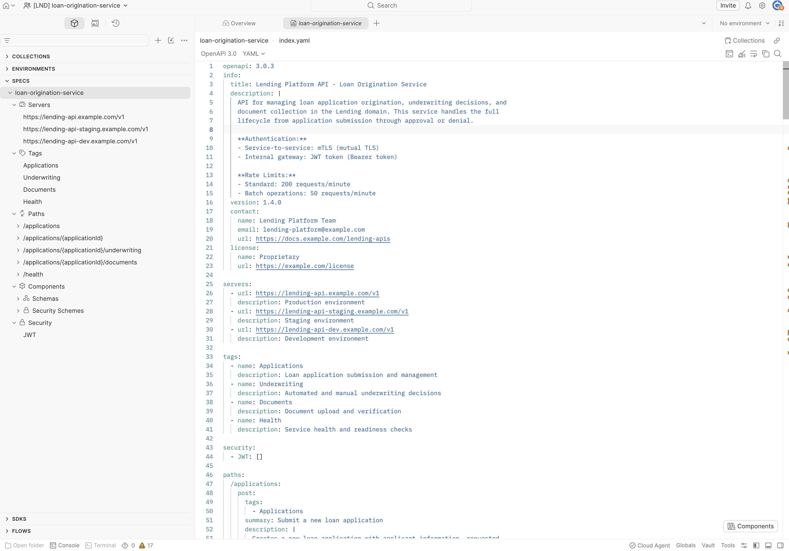
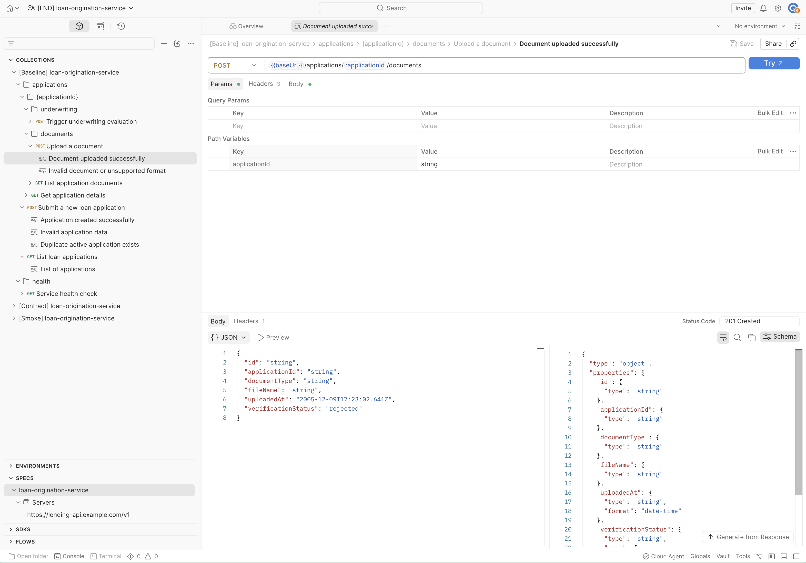
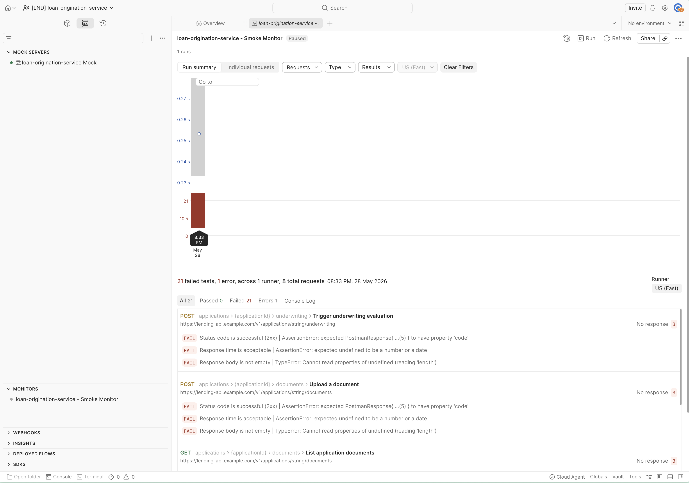

# Validation Evidence — Loan Origination Service

Five screenshots from the `[LND] loan-origination-service` Postman workspace,
showing the open-alpha onboarding action's end-to-end result: workspace,
spec, collection (with multipart upload), environments, and a monitor that
exercised the catalog.

All artifacts were generated by a single `gh workflow run` against
`postman-cs/postman-api-onboarding-action@v0`. No manual workspace
construction. See `README.md §6` and `ADAPTATION.md` for surrounding
narrative.

---

## 1. Workspace home + collection structure

![Baseline collection — POST /applications/{applicationId}/documents with multipart upload response in [LND] workspace](screenshots/Workspace-home.png)

The `[LND] loan-origination-service` workspace contains the three
spec-derived collections the action produces — `[Baseline]`, `[Contract]`,
`[Smoke]` — each with the same logical request structure derived from the
OpenAPI spec's paths:

- `applications/` — `Submit a new loan application`, `List loan applications`
- `applications/{applicationId}/` — `Get application details`
- `applications/{applicationId}/underwriting/` — `Trigger underwriting evaluation`
- `applications/{applicationId}/documents/` — `Upload a document`, `List application documents`
- `health/` — `Service health check`

The Baseline collection is expanded. Each leaf request has example
responses pre-populated (`Document uploaded successfully`,
`Invalid document or unsupported format`, etc.) — those are the response
examples the action extracted from the spec's response schemas. The right
pane shows the response body for `Document uploaded successfully` (HTTP
201): an `id`, `applicationId`, `documentType`, `fileName`, `uploadedAt`,
and `verificationStatus` — exactly the shape the spec promises.

**What this proves:** the action read the spec, generated three
collections, structured them by tag, populated requests with path params
and response examples. No hand-editing required.

---

## 2. Spec in Spec Hub



The Loan Origination OpenAPI spec is uploaded to Spec Hub and parses
correctly. The sidebar reveals the structure the action processed:

- **3 Servers** — `lending-api.example.com/v1` (prod / staging / dev)
- **4 Tags** — `Applications`, `Underwriting`, `Documents`, `Health` (collection folders mirror these)
- **5 Paths** — `/applications`, `/applications/{applicationId}`, `/applications/{applicationId}/underwriting`, `/applications/{applicationId}/documents`, `/health`
- **Components** — schemas and security schemes (JWT)
- **Security** — `JWT` (bearer token)

The right pane shows the YAML source. Important detail from lines 9-11:

```yaml
**Authentication:**
- Service-to-service: mTLS (mutual TLS)
- Internal gateway: JWT token (Bearer token)
```

**mTLS lives in the spec's `info.description` prose, not in
`securitySchemes`.** The generated collection therefore wires JWT (the
schema-declared auth), which is the correct behavior — the action can't
synthesize an auth mechanism the spec doesn't formally declare. mTLS is
wired customer-side via the action's `ssl-client-cert`,
`ssl-client-key`, `ssl-client-passphrase` inputs (commented in
`onboard.yml` with provisioning instructions). This is documented as
Customer-Side Requirements §4 item #1 in the README and Follow-up #1 in
`ADAPTATION.md`.

**What this proves:** the catalog story works — the spec is discoverable
in Spec Hub, lines up structurally with the generated collections, and
the auth-mechanism design decision is principled (config, not gap).

---

## 3. Baseline collection — multipart file upload endpoint



This is the loan-specific differentiating shot. `POST
/applications/{applicationId}/documents` is the multipart upload
endpoint — present in this spec, absent in the companion (Payments)
spec. The request is correctly wired:

- **Method + URL**: `POST {{baseUrl}}/applications/:applicationId/documents`
- **Path variable** `applicationId` populated with example value `string`
- **Headers tab** indicator dot (`Headers 3`) — content negotiation headers present
- **Body tab** indicator dot — request body defined
- **Response shown**: `Document uploaded successfully` (HTTP 201) with a fully populated example payload — `id`, `applicationId`, `documentType`, `fileName`, `uploadedAt` (ISO 8601 timestamp), `verificationStatus`
- **Right pane**: the response schema with `type: object` and the typed properties (string, string, string, date-time, etc.)

**Verification observation:** the request body type and the multipart
`file` part are encoded correctly by the action's spec-to-collection
generator. No post-generation patching required. This had been flagged
as a potential edge case in `ADAPTATION.md` follow-up #2 — confirmed
clean here.

**What this proves:** generated collections include realistic, callable
requests with populated example responses and matching schemas — not
empty shells. The multipart endpoint, which is the riskiest endpoint
shape in this spec, generated cleanly.

---

## 4. Three environments populated from spec servers block

![Three environments in [LND] workspace — loan-origination-service dev / prod / staging — with prod selected showing baseUrl and AWS variables](screenshots/environments.png)

The sidebar shows **three environments** — `loan-origination-service - dev`,
`loan-origination-service - prod`, `loan-origination-service - staging` —
matching the three URLs in the spec's `servers` block. (The Payments
companion has four — `prod`, `uat`, `qa`, `dev` — because its spec
declared four. Per-service config in action.)

The `prod` environment is open in the right pane. Variables populated by
the action:

| Variable | Value | Notes |
|---|---|---|
| `baseUrl` | `https://lending-api.example.com/v1` | From the spec's `servers[0].url`. Real URL goes here customer-side. |
| `CI` | `false` | Run flag |
| `RESPONSE_TIME_THRESHOLD` | `2000` | Default monitor assertion threshold (ms) |
| `AWS_ACCESS_KEY_ID` | (secret placeholder) | Auth scaffolding |
| `AWS_SECRET_ACCESS_KEY` | (secret placeholder) | Auth scaffolding |
| `AWS_REGION` | `eu-west-2` | Region placeholder |
| `AWS_SECRET_NAME` | `api-credentials-prod` | Secret-manager reference |

**What this proves:** environments are spec-driven (count + URL pattern
match the spec), variable names are present and conventionally named for
secret-manager wiring, and the per-environment baseUrl matches the env
name. Customer-side work is filling in the secret values and replacing
`example.com` URLs with real internal hosts — a knowable, scoped ask
(Customer-Side Requirements §4 item #2).

---

## 5. Monitor wired and exercising the catalog



The `loan-origination-service - Smoke Monitor` exists and ran on-demand.
One run executed; the run summary shows the monitor exercising the smoke
collection: **21 assertions across 8 requests**, 1 runner, US (East)
region. Visible requests in the failure list:

- `POST /applications/{applicationId}/underwriting` — Trigger underwriting evaluation
- `POST /applications/{applicationId}/documents` — Upload a document
- `GET /applications/{applicationId}/documents` — List application documents

All 21 assertions failed with a consistent error pattern:

```
FAIL  Status code is successful (2xx) | AssertionError: expected ...(5)... to have property 'code'
FAIL  Response time is acceptable    | AssertionError: expected undefined to be a number or a date
FAIL  Response body is not empty     | TypeError: Cannot read properties of undefined (reading 'length')
```

**The failure pattern itself is the evidence the wiring works.** Status
code 5xx + empty response body means the monitor reached out to
`https://lending-api.example.com/v1/applications/string/underwriting`
(and equivalents) — the real spec-declared runtime URLs, not the mock —
and got DNS / network failures because `example.com` hosts aren't
reachable. The monitor is correctly invoking the catalog; what's
missing is real backend URLs.

When the customer's platform team drops real lending-api URLs into
`env-runtime-urls-json` and re-runs the workflow, the monitor turns
green. That's Customer-Side Requirements §4 item #2 made concrete.

**What this proves:**
1. The monitor exists and is wired against the smoke collection.
2. The smoke collection invokes the right endpoints — 8 requests
   matching the spec's path structure.
3. Auto-generated assertions exist and execute (success-code check,
   response-time threshold, non-empty body).
4. The failure mode is informative, not a hidden gap — pointing the
   monitor at real hosts is the customer-side fix.

This is a more useful demo screenshot than a forced-green run against
the mock would have been. The "what's left to make it green" answer is
a one-line config change.

---

## Why these five shots together

The brief asks for screenshots or other artifacts proving the
onboarding worked. These five cover the full catalog story:

| Screenshot | What's proven |
|---|---|
| 1. Workspace + collections | The action created and structured three collections from the spec, with populated example responses |
| 2. Spec in Spec Hub | The spec is discoverable, parses correctly, and the auth-design decision (JWT in schema, mTLS in prose → customer-side cert provisioning) is principled |
| 3. Baseline multipart request | Generated requests are callable, with the trickiest endpoint shape in the spec (file upload) handled cleanly |
| 4. Three environments | Spec-driven environment count and naming; secret-manager-shaped variable scaffolding |
| 5. Monitor execution | Coverage story works end-to-end; failure mode points to a one-line customer-side fix, not a tool gap |

For the companion (Payments) workspace, the equivalent five screenshots
live in `jr-cse-payments-postman-onboarding/docs/screenshots/`. The
visual diff between the two workspaces is `ADAPTATION.md` rendered.
